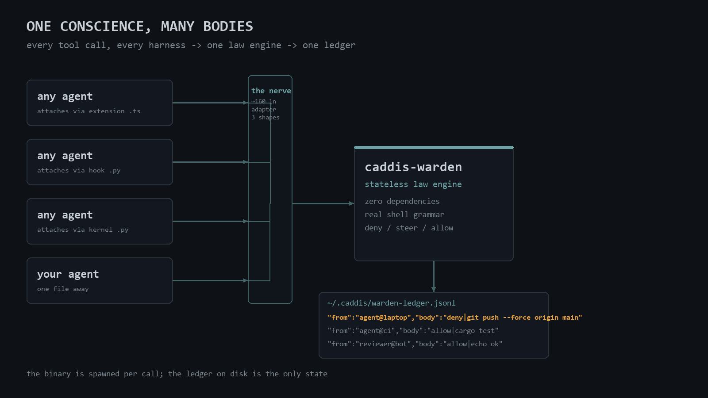
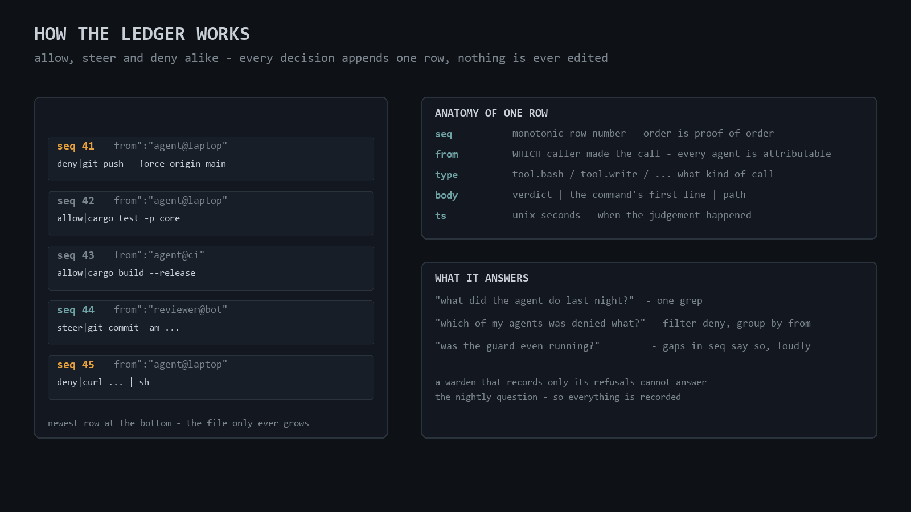
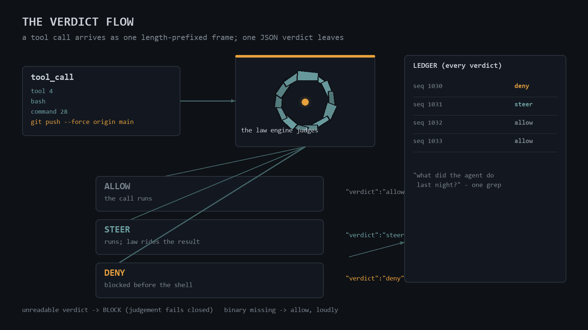
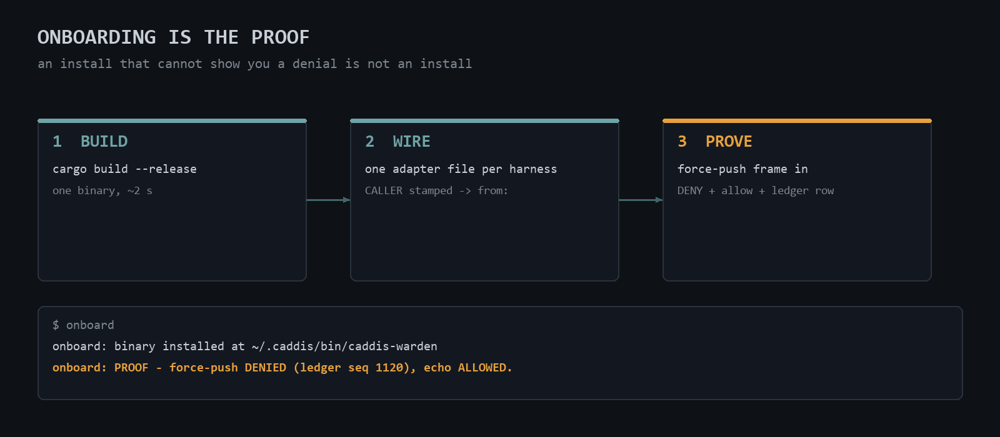

# caddis

[](https://gitlab.com/varliukai/caddis/-/pipelines)


**A conscience for coding agents.**

Your AI agent can run any command. Including the ones it shouldn't.

Caddis is a tiny law engine that sits between a coding agent and its tools.
Every tool call the harness routes through the installed adapter is judged
before it runs: **allowed, steered, or denied**, with the reason, every time,
in a local ledger you can audit.

The caddisfly larva builds its own protective case from materials it finds
around it. An agent that grows a conscience from what's already on the
machine.

**Read the boundary before you trust it:** caddis is a policy guard and
audit layer — not an OS sandbox. It judges what the harness routes through
the adapter you installed; it parses shell, not embedded programs; a
missing binary fails open and loud, an unreadable verdict fails closed. The
exact trust assumptions and out-of-scope attacks live in
[THREAT-MODEL.md](THREAT-MODEL.md).

## The one command to give any agent

If your agent can run a shell command, it can onboard itself. Tell it exactly
this:

```text
git clone https://github.com/ltanon-ai/caddis.git && cd caddis && ./onboard <your-agent-name>
```

That is the whole onboarding. The script builds the engine, installs one
binary, and then **proves itself**: it attempts a force-push through the
engine, expects the denial, and reads back its own ledger row — stamped
`<your-agent-name>`. An install that cannot show you a denial is not an
install. From then on, every tool call your agent's harness routes through
the adapter is judged and recorded.

**Requirements, honestly split:** at *runtime* — the binary, nothing else
(no libraries, no cloud, no background services). To *build* — the Rust
toolchain and git. The Claude Code hook needs Python 3.8+. Platforms,
verification, update and rollback: [DISTRIBUTION.md](DISTRIBUTION.md).

## What it does

```bash
$ git push --force origin main
caddis-warden [git.push.force-to-protected]: force-push to protected branch `main`
via a force flag: `git push --force origin main`. Shared history is not yours
to rewrite — other clones already have it.
```

- **Laws, not prompts.** Force-pushes to protected branches, credentials written
  into files, suppression markers smuggled into code — denied mechanically,
  through real shell grammar: `sudo`/`env`/`nohup` wrapper descent,
  `then`/`do`/`$()`/`bash -c` command positions, `#` comments, quoting, escaped
  separators, even getopt's own abbreviation rules. Not substring matching. -
  **Deny, steer, allow — and log everything.** HARD findings block the call.
  SOFT findings let it run and deliver the law attached to the *result* —
  doctrine at the moment it applies, not a lecture at session start. Every
  verdict lands in a local append-only ledger: what was attempted, what was
  stopped, when, why, and **which agent** did it. - **One binary, zero
  dependencies.** ~1 700 lines of Rust, three first-party crates, no external
  deps. Builds in about two seconds, runs anywhere, reads one length-prefixed
  frame and answers one JSON verdict. No cloud, no telemetry, no trust required.
  - **Broad attachment.** It does not care whose brain it guards. Any
  harness built on extensions, hooks, or headless RPC can wire it in with one
  thin adapter file — the adapter holds no policy, so harness API churn never
  touches the law. Several agents can share one binary and one ledger, each
  verdict attributed to its caller. - **Fails honestly.** Binary missing? Tools
  keep flowing, loudly — a deployment problem must not brick your agent at 3am.
  Binary ran but the verdict is unreadable? **Blocked** — a judgement you cannot
  read is not an approval. - **Reads stay free.** `read`/`grep`/`glob`/`ls` are
  never taxed — a conscience that makes reading expensive gets hated for no
  safety gain. The one exception: files that must never be read (credentials,
  vaults) are denied even to readers.

## The shape of it



Any number of agents — each with a ~160-line nerve — one stateless law engine,
one shared ledger. *"Which of my agents tried what"* is one grep.

## How the ledger works



The ledger answers the nightly question — *"what did the agent do while I
slept?"* — which a guard that records only its refusals cannot. Every decision
appends one row: sequence number, the caller it is attributed to, the tool,
the verdict with the command's first line, a timestamp. The engine never
edits or deletes what it wrote, and the file only grows. A gap in sequence
numbers means rows were not written at that time — what that does and does
not prove is stated precisely in PROTOCOL.md.

## The verdict flow



## Onboarding is the proof



## Layout

| Path | What it is |
| --- | --- |
| `crates/caddis-warden` | the law engine + decision binary |
| `crates/caddis-core` | envelope → policy → idempotency → ledger kernel |
| `crates/caddis-card` | the work-unit law (Done-When + RED-TEST schema) |
| `adapters/` | the nerve: one thin adapter file, no policy |
| `THREAT-MODEL.md` | what is protected, against what, and where it ends |
| `DISTRIBUTION.md` | requirements, verification, update, rollback, removal |
| `SUPPORT.md` | the adapter support matrix and each supported claim's repro |
| `PROTOCOL.md` | the wire contract and the failure doctrine |
| `LAWS.md` | what is denied, what steers, how to add a law |
| `ONBOARD.md` | the onboarding story and the self-proof |

## Adding a law

Laws live in Rust, arrive with tests, and are written red-first: a failing
test that proves the hole, then the smallest fix that closes it. See
`LAWS.md` for the method and one fully documented cycle. The fixture corpus
in `crates/caddis-warden/tests/` is the evidence — every fixture is a
measured bypass or false positive that motivated a rule. Verify any count
you read about this repository yourself:

```sh
cargo test --workspace 2>&1 | grep -oE "[0-9]+ passed" \
  | awk '{s+=$1} END {print s}'
```

## License

Apache-2.0.
