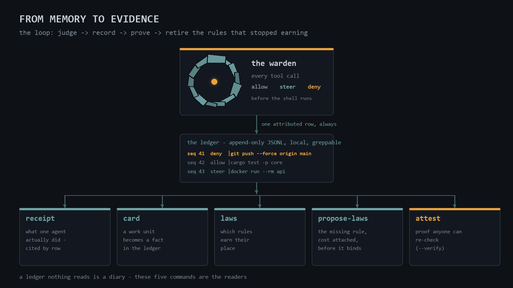
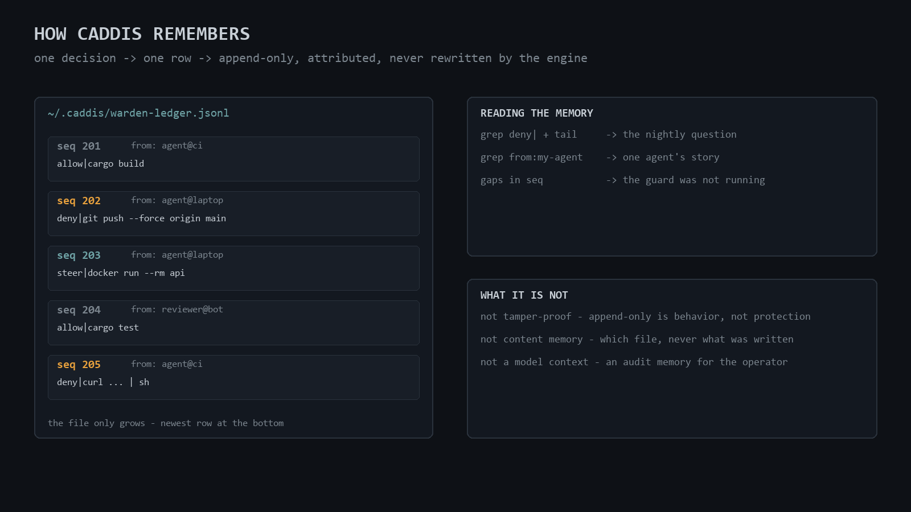
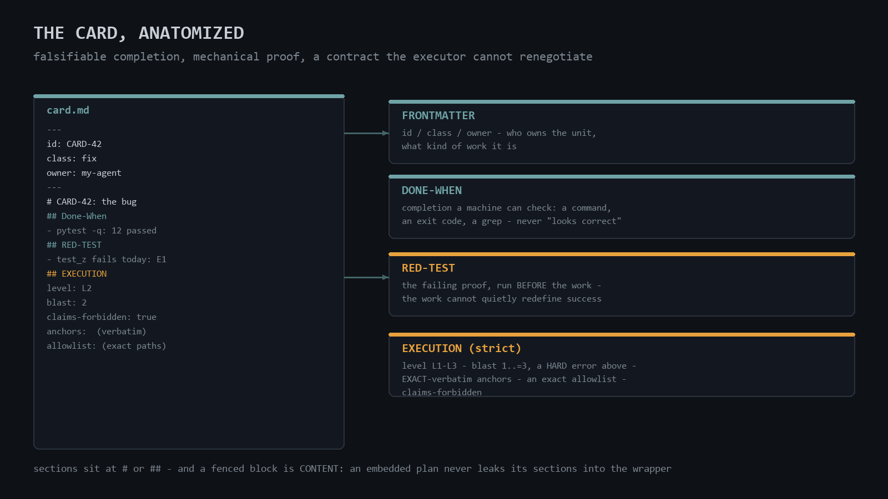
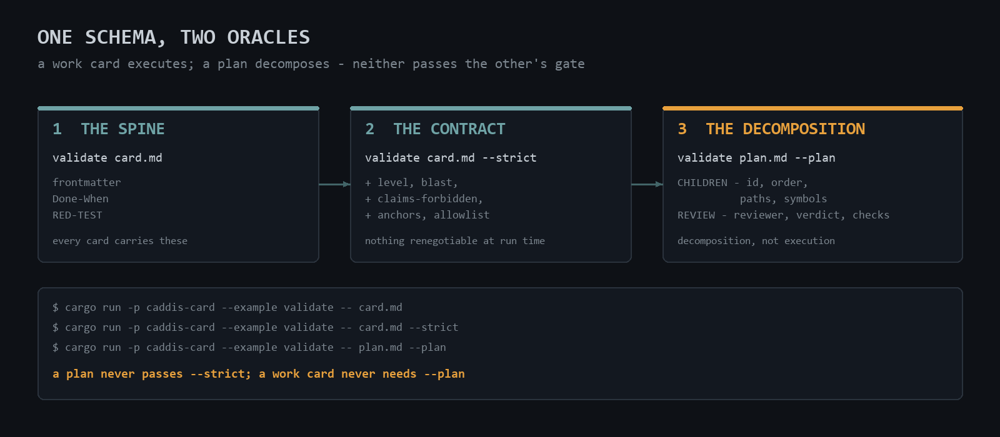
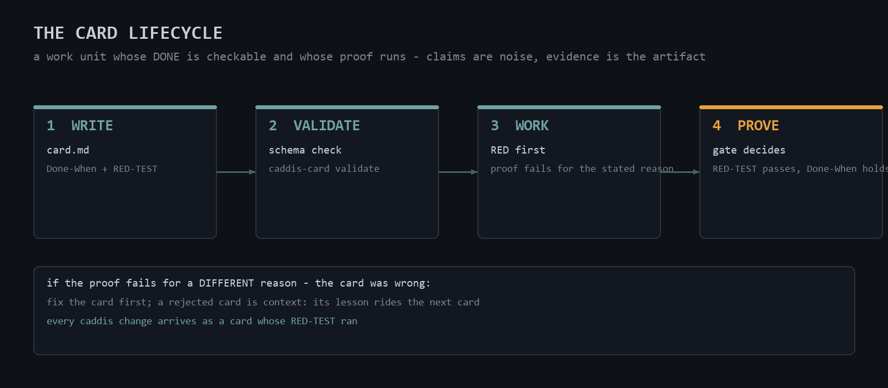
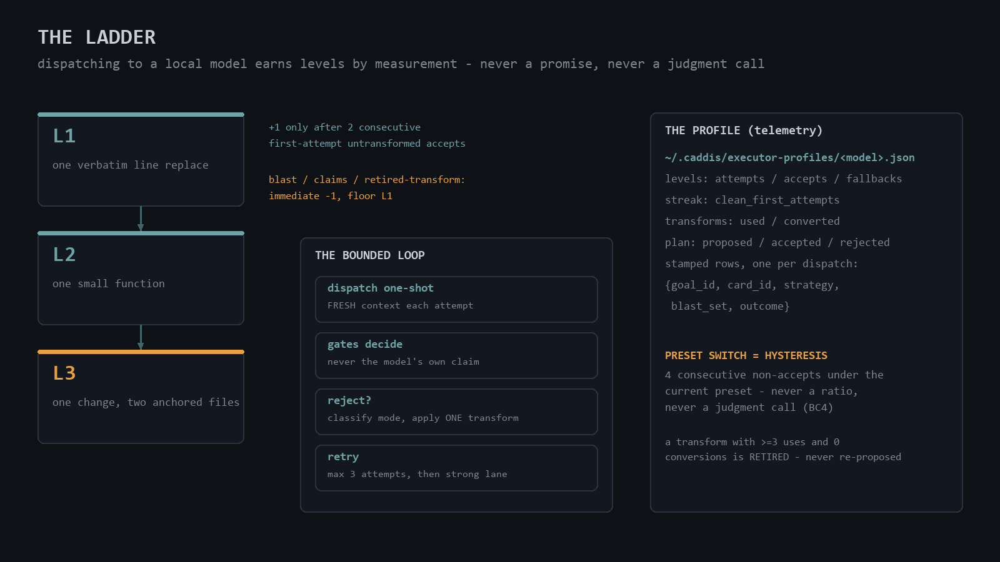
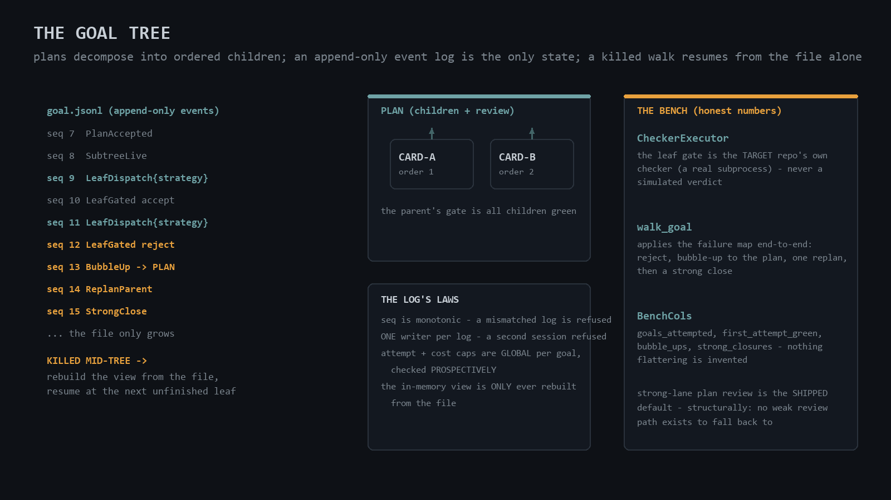

# caddis


### Your agent says it's done. Can you check?

Not re-run it. **Check it.**

Caddis is one small binary that sits between a coding agent and its tools. It
judges every tool call, remembers every decision in an append-only ledger, and
then — the part nothing else seems to do — **turns that memory into evidence you
can hand to someone else.**

```console
$ caddis-warden attest --card CARD-0111
attest: CARD-0111
  window      : ledger rows 0..4 (physical position, never seq)
  declared    : blast 2, allowlist src/allowed.rs
  verdicts    : allow 2  steer 0  deny 1
  OUTSIDE     : 1 file(s) written outside the declared allowlist:
                src/sneaky.rs
  RED-TEST    : a matching command was ATTEMPTED in the window (not proof it passed)

$ caddis-warden attest --verify bundle.json
  CONFIRMED    allow                 bundle=2 ledger=2
  CONTRADICTED files_outside_count   bundle=0 ledger=1

1 CLAIM(S) CONTRADICTED — this bundle does not match the ledger.
```

That second command is the whole point. An agent's claim about its own work
stops being something you take on faith and becomes something **anyone** can
re-check against the record — you, a reviewer, another agent, or a future
session with no memory of any of it.

**Install is one line, and it refuses to lie about itself:**

```text
git clone https://github.com/ltanon-ai/caddis.git && cd caddis && ./onboard <your-agent-name>
```

It builds, installs, then **proves itself** — attempts a real force-push,
expects the denial, and reads back its own ledger row. An install that cannot
show you a denial is not an install.

---

### Why this and not a permission prompt

Most guardrails answer one question — *may this command run?* — and answer it
twice: yes or no. Caddis answers three, and the middle one is why it exists.

| | | |
| --- | --- | --- |
| **allow** | run it | nothing to say |
| **steer** | run it — **and deliver the relevant lesson at the moment it applies** | doctrine arrives when it is useful, not at session start where it is read once and forgotten |
| **deny** | don't | reserved for the unambiguous, because a guard that blocks legitimate work gets switched off, and a switched-off guard protects nothing |

Real steers from a real session, unprompted, at the instant each mistake was
about to be made:

```text
shell.exit-code-through-pipe   `$?` after a pipeline reports the LAST process, not the one being judged
shell.gate-chained-into-commit a gate chained with && into git commit commits on red
git.stage.blanket-in-shared-worktree  `git add -A` in a worktree another writer shares
```

### What I believe is genuinely new — and what isn't

Stated carefully, because overclaiming is the one thing this project's own laws
forbid.

**Not new:** guarding an agent's tool calls. Permission systems, hooks and
sandboxes all do it, several of them better at containment than caddis, which is
a policy guard and *not* an OS sandbox.

**What I have not seen elsewhere:**

- **Replay.** Before a new rule ever guards a live agent, score it against your
  own recorded history: *"this would have denied 3 of your last 14,036 calls —
  here they are."* Adoption fear and regression fear, both answered from data
  you already have.
- **A law market.** Rules carry their own usage record and earn a verdict:
  `EARNING`, `WALLPAPER` (fires constantly, routinely worked around), `DEAD`
  (never fired). Its first run on a real ledger found a rule that had fired
  twice in its entire life and been circumvented both times, and six that had
  never fired at all. Rule corpora rot precisely because nobody can see this.
- **Laws discovered from history, each shipping its own falsifier.** Mine the
  ledger for *allowed-then-immediately-undone* and propose the missing rule —
  with the cost of adopting it attached, so you see the false positives before
  you say yes, not after.
- **Attestation bundles.** Proof that travels with the work and re-checks
  against the ledger, so *the builder never grades its own work* stops being
  discipline and becomes a command.

**The honest claim is the loop, not any one part:** judge → record → prove →
retire the rules that stopped earning. Each piece exists somewhere; closing the
circle locally, with no cloud and no service, is what I think is distinctive.

### What it's built on

Rust, and **the trusted core carries zero external dependencies** — no serde, no
frameworks; the kernel is meant to be auditable by reading it. The ledger is
plain append-only JSONL you can `grep`. The warden is **stateless by design**:
spawned once per tool call, holding nothing between calls, so there is no daemon
to supervise and a crash costs exactly one decision. Adapters are one thin file
per harness — Python for Claude Code, TypeScript for others — carrying no policy
at all. Everything runs on your machine; **there is no cloud anywhere in it, and
nothing is ever sent off the box.**

---

### The parts

| Node | What it is |
| --- | --- |
| **Warden** | judges each adapter-routed tool call: allow, steer, deny |
| **Ledger** | append-only audit: what, when, why, which agent |
| **Cards** | falsifiable work units: Done-When + RED-TEST |
| **Receipt** | what one caller actually did, reconstructed from the ledger |
| **Attest** | a proof bundle, and `--verify` that re-checks it |
| **Laws** | which rules are EARNING, WALLPAPER, or DEAD |
| **Ladder** | measured L1–L3 levels for local model executors |
| **Skill** | the manual the agent itself loads and obeys |
| **Adapters** | one thin nerve per harness, no policy inside |
| **Onboard** | one command; proves itself with a live denial |
| **Replay** | preview law changes against your own history |
| **Report** | reads the ledger back: counts, callers, deny-by-law |

The caddisfly larva builds its own protective case from materials it finds
around it. An agent that grows a conscience from what's already on the
machine.

**Read the boundary before you trust it:** caddis is a policy guard and
audit layer — not an OS sandbox. It judges what the harness routes through
the adapter you installed; it parses shell, not embedded programs; a
missing binary fails open and loud, an unreadable verdict fails closed. The
exact trust assumptions and out-of-scope attacks live in
[THREAT-MODEL.md](THREAT-MODEL.md).

## Onboarding, in full

If your agent can run a shell command, it can onboard itself — hand it the line
from the top of this file verbatim:

```text
git clone https://github.com/ltanon-ai/caddis.git && cd caddis && ./onboard <your-agent-name>
```

That is the whole onboarding. The script builds the engine, installs one
binary, and then **proves itself**: it attempts a force-push through the
engine, expects the denial, and reads back its own ledger row — stamped
`<your-agent-name>`. An install that cannot show you a denial is not an
install. From then on, every tool call your agent's harness routes through
the adapter is judged and recorded.

**Requirements, honestly split:** at *runtime* — the binary, nothing else
(no libraries, no cloud, no background services). To *build* — the Rust
toolchain and git. Both Python adapters (the Claude Code hook and the rlm
kernel nerve) need Python 3.8+. Platforms, verification, update and
rollback: [DISTRIBUTION.md](DISTRIBUTION.md).

## What it does

```bash
$ git push --force origin main
caddis-warden [git.push.force-to-protected]: force-push to protected branch `main`
via a force flag: `git push --force origin main`. Shared history is not yours
to rewrite — other clones already have it.
```

- **Laws, not prompts.** Force-pushes to protected branches, credentials written
  into files, suppression markers smuggled into code — denied mechanically,
  through real shell grammar: `sudo`/`env`/`nohup` wrapper descent,
  `then`/`do`/`$()`/`bash -c` command positions, `#` comments, quoting, escaped
  separators, even getopt's own abbreviation rules. Not substring matching.
- **Destructive commands are a class, not a substring.** `rm -rf` against a
  protected root — `/`, `/usr`, `C:\`, `$HOME`… — is denied in every flag
  spelling, through `sudo`/`env` wrapper descent, and so are the shapes that
  become one: the NULL-variable expansion (`rm -rf $UNSET_VAR/` is
  effectively `rm -rf /`), the `..` escape above the workspace, the `.*`
  glob, and bare `*` at the workspace root. Named build dirs (`build/`,
  `dist/`) stay free — build output is legitimate work. `curl | bash`
  STEERS, never denies: a domain trustlist names rustup, Homebrew and bun;
  everything else shows the untrusted URL verbatim, so the reader judges the
  source with the evidence in hand.
- **Deny, steer, allow — and log everything.** HARD findings block the call.
  SOFT findings let it run and deliver the law attached to the *result* —
  doctrine at the moment it applies, not a lecture at session start. Every
  verdict lands in a local append-only ledger: what was attempted, what was
  stopped, when, why, and **which agent** did it.
- **One binary, zero dependencies.** ~10 400 lines of Rust source across five
  first-party crates (plus a ~6 300-line red-first test corpus), no external
  deps. Builds in about two seconds, runs anywhere, reads one
  length-prefixed frame and answers one JSON verdict. No cloud, no telemetry,
  no trust required.
- **Broad attachment.** It does not care whose brain it guards. Any
  harness built on extensions, hooks, or headless RPC can wire it in with
  one thin adapter file — the adapter holds no policy, so harness API
  churn never touches the law. Several agents can share one binary and
  one ledger, each verdict attributed to its caller.
- **Replay — the memory is a simulator.** `caddis-warden --replay
  <ledger>` re-judges recorded history against the current law and
  reports the diff: every NEW-DENY is a future false positive caught
  for free, every FREED is a historical over-fire the new law fixes.
  It also counts what fired — a per-law deny/steer summary over the
  judged rows, plus the never-fired list straight from the registry —
  so law coverage is read, not assumed. The only guard you can safely
  update — because you can preview the update against your own nights.
- **Fails honestly.** Binary missing? Tools keep flowing, loudly — a
  deployment problem must not brick your agent at 3am. Binary ran but the
  verdict is unreadable? **Blocked** — a judgement you cannot read is not an
  approval.
- **Reads stay free.** `read`/`grep`/`glob`/`ls` are never taxed — a
  conscience that makes reading expensive gets hated for no safety gain. The
  one exception: files that must never be read (credentials, vaults) are
  denied even to readers.

## The shape of it


Any number of agents — each with a ~160-line nerve — one stateless law engine,
one shared ledger. *"Which of my agents tried what"* is one grep.

## The verdict flow


The wire contract is deliberately boring: one length-prefixed frame in
(byte counts, never characters — arbitrary payloads cannot break the frame),
one JSON verdict out. The full contract, including which adapter fields are
scanned and the two failure modes that are deliberately NOT the same, is
[PROTOCOL.md](PROTOCOL.md).

## How the ledger works


The ledger answers the nightly question — *"what did the agent do while I
slept?"* — which a guard that records only its refusals cannot. Every decision
appends one row: sequence number, the caller it is attributed to, the tool,
the verdict with the command's first line, a timestamp. The engine never
edits or deletes what it wrote, and the file only grows. A gap in sequence
numbers means rows were not written at that time — what that does and does
not prove is stated precisely in PROTOCOL.md.

Reading it back is a first-class command: `caddis-warden report --since 24`
aggregates the ledger *as recorded* — no re-judgement — into counts by
verdict and caller, first/last timestamps, and deny reasons grouped by the
law id; `--from`, `--verdict`, `--last` narrow it and `--json` feeds
machines.

## From memory to evidence — the loop

A ledger nothing reads is a diary. These five commands are the readers that turn
it into evidence, and each one states the limits of what it can prove.



**`caddis-warden receipt --from <agent> --since <hours>`** — reconstructs what
one caller did in one window: verdict counts, per-tool counts, distinct files
written, denials grouped by the law that drew them *with the rows cited*, and
any card left open. Paste it into a handoff and the prose becomes checkable
against a record instead of against someone's memory.

**`caddis-warden card open <card.md>` … `card close`** — a card becomes a fact
in the ledger, not a promise in a file. With one open, a write outside its
declared `allowlist` is **denied** when the target is certain (a file tool's
path, a literal redirect) and **steered** when it was only inferred from shell
text. With no card open, nothing changes — the gate is invisible until you opt
in.

**`caddis-warden laws`** — every registered rule with its usage record and one
of three verdicts: `EARNING`, `WALLPAPER`, `DEAD`. The circumvention figure is a
*heuristic* and says so everywhere it appears, including inside the JSON, so a
machine consumer can never be handed a number the human report hedges.

**`caddis-warden propose-laws`** — mines *allowed-then-immediately-undone* pairs
and proposes the missing rule. **Every candidate carries what adopting it would
have cost**, measured over the whole ledger. On its first real run that promptly
condemned its own output — four candidates that would each have denied dozens to
hundreds of legitimate commands — which is exactly the job. It installs nothing;
a conscience that writes its own rules unread is a different and much larger
decision.

**`caddis-warden attest --card <ID>` / `--verify <bundle>`** — the proof bundle
from the top of this file. Every bundle carries its own limits in a field of its
own, so a reader who only ever sees the JSON still sees what it cannot show.

**What attestation deliberately does not claim.** The warden fires *before* a
tool runs, and no ledger row carries an exit code. A bundle therefore cannot say
a test failed before your change and passed after; it says a matching command
was **attempted** in the window. An honest bundle that admits the gap is worth
more than a confident one nobody can check — and closing that gap is the next
piece of work, not a claim made early.

## Memory — how caddis remembers

The plugin has exactly one memory: the verdict ledger. One row per
decision — allow, steer and deny alike — attributed to the caller, capped
and masked, append-only. Reading it, querying an agent's story, what it
is and is not: [MEMORY.md](MEMORY.md).



## Cards — the work-unit law

Caddis is built with a discipline where every unit of work is a **card**: a
small document whose completion is *falsifiable* and whose proof is
*mechanical*. That discipline ships as a zero-dependency Rust validator —
three small modules in `crates/caddis-card` — you can use for your own
work; the same law governs how this repository itself changes.



### The two mandatory sections

A card has YAML frontmatter (`id`, `class`, `owner`) and sections. Two
sections are mandatory — the schema rejects a card without them, mechanically:

- **Done-When** — the completion criterion in a form a machine can check:
  "pytest X passes", "grep Y finds Z". Never "looks correct".
- **RED-TEST** — how you prove the work is not lying: the failing test, the
  measured before/after, the command whose exit code settles it. You run it
  *before* the work, so the work cannot quietly redefine success.

Sections may sit at heading level one or two — markdown's single-H1 rule and
the card schema do not fight. And a fenced block is always **content**: a
card that embeds a whole other document (a plan inside a ```text fence) never
leaks the embedded document's headings as its own sections.

### The strict EXECUTION contract

`validate --strict` adds the contract a card destined for a local executor
must carry — every field the dispatch machinery reasons about, nothing it can
renegotiate at run time:

| Field | Meaning |
| --- | --- |
| `level` | L1–L3; absent or invalid defaults LOW (L1) |
| `blast` | paths the card may touch; 1..=3, hard error outside |
| `claims-forbidden` | output the work only; gates decide, not claims |
| `anchors` | the EXACT current bytes of each file, verbatim |
| `allowlist` | the exact editable paths; nothing else |

Two annexes ride on strict cards without ever broadening them: a
**CONTINUATION** annex carries context between chained cards but its
`blast-cap` may never exceed the card's own `blast`; a **SPLIT** marker names
ordered children when a card is too thick for its executor — each child is a
full strict card of its own, and the parent's gate is all children green.

### Plan cards

A card of `class: plan` is decomposition, not execution — a different oracle.
It carries `CHILDREN` (ordered: id, order, paths, symbols) and a `REVIEW`
receipt (reviewer, verdict, checks). `validate --plan` checks that structure
and deliberately refuses the strict contract: demanding execution anchors
from a document whose job is decomposition would be checking the wrong thing.
A plan never passes `--strict`; a work card never needs `--plan`.



The full method, a worked example, and where the schema lives:
[CARDS.md](CARDS.md).



## The ladder — dispatching to local models

Small models are cheap and live on your machine; the honest question is what
a given model can actually do unsupervised. Caddis's answer is a **ladder**:
levels are earned by measurement, never promised, and every rule is
mechanical.



Three levels, three measured capabilities: **L1** — one verbatim line
replace; **L2** — one small function; **L3** — one change across two
anchored files. Promotion needs **two consecutive first-attempt,
untransformed accepts**. A blast violation, a claims violation, or a
retired-transform hit demotes immediately — floor L1. The dispatch loop
is bounded: one-shot dispatch with a FRESH context each attempt, gates
decide (never the model's own claim), on reject classify the mode and
apply exactly ONE transform — at most three attempts in total, then the
strong lane closes it.

Transforms are hypotheses, not habits: each retry records whether the
transform actually converted the rejection. A transform with three or more
uses and zero conversions is **retired** and never proposed again. The
fallback tax — strong-lane closures per level — is recorded as the honest
cost of running small models; switching presets is mechanical **hysteresis**:
four consecutive non-accept outcomes under the current preset, never a ratio
and never a judgment call.

Every dispatch stamps a row — `{goal_id, card_id, strategy, blast_set,
context_bytes, outcome}` (schema v3) — into the model's profile at
`~/.caddis/executor-profiles/<model>.json`. The profile is capability
telemetry: it is never "memory", never merged into the warden ledger, and it
never broadens what a card allows. `context_bytes` is the measured card +
anchors + annex byte sum the dispatch actually carried, because a small
model's capability is context-size-conditioned — the same card can be
trivial at 2 KB and hopeless at 20. The ladder also has its own plan
oracle: plans proposed / well-formed / intent-accepted / intent-rejected,
with its own promotion streak — plan outcomes never contaminate execution
telemetry.

Before any model's first dispatch it runs the shipped **calibration packs**
(`skills/caddis/calibration/`): real cards with real fixtures — a line
replace, a function stub, a two-file change, and two plan-review exercises.
The pack's `KEY.md` stays with the operator: the model under calibration
never sees the expected verdicts it is being scored against.

## The skill — the manual the agent reads

Everything above describes the system for you, the operator. The skill
is the same system written for the other side: `skills/caddis/` is a
self-contained skill a harness loads, and it changes how the agent
works — not only what it may run.

| Part | Role |
| --- | --- |
| `SKILL.md` | operating rules: card-first, conscience commands |
| `ladder.py` | the profile store: levels, streaks, transforms |
| `calibration/` | the packs that measure a model before dispatch |

- **Card-first is the default.** The agent writes the card before any
  unit of work beyond a one-liner, validates it, works RED-first, and
  lands the evidence — the skill says so, with the commands.
- **The conscience commands.** The nightly question, one agent's story,
  replay before a warden swap: shell commands the agent itself runs.
- **The ladder, mechanized.** The rules of the section above, as rules
  the agent must not override by judgment; local gates always win.

The distinction, stated once: these documents are the **description** —
what caddis is, written for humans. The skill is the **instruction** —
how an agent works inside caddis, loaded by the harness and fired on
its triggers: a blocked call, the start of non-trivial work, a
dispatch to a local model, a question about what an agent did.

## The goal tree — many cards, one goal

Real work is rarely one card. `crates/caddis-tree` organizes a goal as a
tree: a plan (validated by the plan oracle) decomposes into ordered child
cards; a walker dispatches the leaves through a named executor trait —
the substrate is deliberately pluggable, and ladder.py stays
profiles-only telemetry alongside it; every step appends an event to a
log that is the tree's only state.



The log's laws are the tree's whole durability story:

- **Events are append-only.** `seq` is monotonic; a log that mismatches its
  own sequence is refused at load.
- **One writer per log.** The orchestrating session owns it; a second
  session attaching to the same log is refused.
- **Caps are global per goal, checked in two phases.** Before a
  dispatch, `can_dispatch` refuses when attempts used already sit at
  the cap; after the executor returns, the append refuses when
  used + incoming cost would exceed the cap — the row that breaks the
  budget never lands.
- **The view is rebuilt, not remembered.** The in-memory state is only
  ever reconstructed from the file — which is what makes
  **kill-mid-tree resume** real: restart after a kill, the rebuild
  shows every gated leaf, a re-dispatch of a finished one refuses with
  AlreadyDone, and the caller continues with the next unfinished
  child.
- **Failures bubble, in stages.** A rejected leaf is retried — up to
  three attempts per leaf; if it still fails, the failure bubbles up to
  the plan, which may replan exactly once — and a subtree that cannot
  converge is strong-closed on a later walk, not inside the same call.
- **Dispatches carry a strategy stamp.** Every LeafDispatch event
  records the preset that produced it, in the tree's log. The ladder's
  determinism and hysteresis rules read a SEPARATE store — the
  executor profile — which the orchestrator feeds via
  `record_dispatch`; the tree never reads it back.

The bench that proves all this is honest by construction: the leaf gate is
the **target repository's own checker**, run as a real subprocess — never a
simulated verdict — and the reported columns (`goals_attempted`,
`first_attempt_green`, `bubble_ups`, `strong_closures`) are counted, not
flattered. Strong-lane plan review is the shipped default *structurally*:
no weak plan-review code path exists to silently fall back to.

## Onboarding is the proof


## The adapters — one nerve, three shapes

No policy lives in an adapter; it marshals one tool call into the wire frame
and applies the verdict. Three shapes ship, one per harness family:

- **`adapters/caddis-warden.ts`** — for extension-based harnesses. A steer is
  delivered on the tool *result* (the action was legitimate; the law arrives
  at the moment it applies), with the owed-laws map keyed by tool-call id and
  deleted on delivery. The caller stamp is a `CALLER` constant the onboard
  script seds per agent.
- **`adapters/claude-code/caddis-warden-gate.py`** — a PreToolUse hook. The
  `from:` stamp comes from an optional `~/.caddis/lanes.json` cwd-prefix →
  label map (longest prefix wins, either path separator, case folded only
  where the filesystem folds it); unmapped sessions are stamped
  `claude-code`, and `CADDIS_WARDEN_STAND_ASIDE=1` makes unmapped sessions
  stand aside silently — a fleet wiring only some directories.
- **`adapters/rlm/warden_repl.py`** — the code-exec nerve for kernel-based
  harnesses: it wraps the *standard library* exec surface (`subprocess.*`,
  `os.system`, `os.popen`), never harness internals, so harness versions
  cannot break it. Deny raises before the exec with the warden's reason;
  steer lands the law beside the output and runs. Its boundary is stated
  where a reader meets it: pure-Python destructiveness with no shell call is
  out of scope — the same register as THREAT-MODEL's embedded-program
  boundary.

One rule with teeth lives in every adapter, for every tool shape: for edits,
only the text being **written** is ever scanned — the warden must never
punish you for cleaning up the very thing it dislikes.

## Quality — measured, not asserted

The repository eats its own cooking:

- **Rust**: `cargo test --workspace` — 492 tests at this release; every law
  lands red-first with its fixture file, the corpus is the evidence.
- **Python**: the adapter, ladder, renderer, install and book-generator suites
  — 68 tests — run in the CI matrix on Linux, Windows and macOS.
- **Coverage**: `cargo llvm-cov` and `pytest --cov` feed the SonarQube wiring
  in `sonar-project.properties` (via `tools/sonar-coverage.py`, which makes
  the reports scanner-relative) — overall coverage is displayed on the
  dashboard, new code is held to the gate.
- **DIY verification** — any count you read about this repository:

```sh
cargo test --workspace 2>&1 | grep -oE "[0-9]+ passed" \
  | awk '{s+=$1} END {print s}'
```

## Layout

| Path | What it is |
| --- | --- |
| `crates/caddis-warden` | the law engine + decision binary |
| `crates/caddis-core` | envelope → policy → idempotency → ledger kernel |
| `crates/caddis-card` | the work-unit law: strict + plan oracles |
| `crates/caddis-tree` | the goal tree: events, walker, plan gates, bench |
| `crates/caddis-organs` | watchdog, canary, checkpoint — **present, not yet wired** |
| `adapters/` | the nerve: one thin adapter file, no policy |
| `skills/caddis/` | the agent-side skill: card-first work, ladder, commands |
| `THREAT-MODEL.md` | what is protected, against what, and where it ends |
| `DISTRIBUTION.md` | requirements, verification, update, rollback, removal |
| `MEMORY.md` | how the plugin remembers: the ledger as memory |
| `CARDS.md` | the work-unit law: cards, and how to use them |
| `SUPPORT.md` | the adapter support matrix and each supported claim's repro |
| `PROTOCOL.md` | the wire contract and the failure doctrine |
| `LAWS.md` | what is denied, what steers, how to add a law |
| `ONBOARD.md` | the onboarding story and the self-proof |

## Adding a law

Laws live in Rust, arrive with tests, and are written red-first: a failing
test that proves the hole, then the smallest fix that closes it. See
`LAWS.md` for the method and one fully documented cycle. The fixture corpus
in `crates/caddis-warden/tests/` is the evidence — every fixture is a
measured bypass or false positive that motivated a rule.

## License

Apache-2.0.
